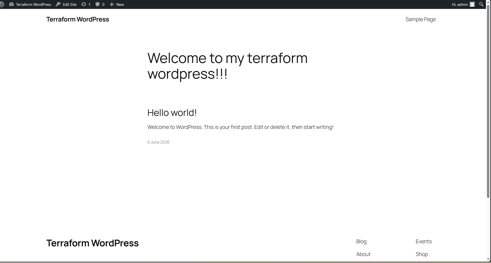

# 📦 Terraform WordPress on AWS (EC2 + RDS)

## 📌 Overview

This project uses **Terraform** to deploy a fully functional WordPress website on AWS.
It provisions infrastructure as code (IaC) including an EC2 instance, security groups, and an RDS MySQL database.

The result is a working WordPress site accessible via a public IP address.

---

# 🏗️ Architecture

```text
Internet
   ↓
EC2 (Ubuntu + Apache + WordPress)
   ↓
RDS MySQL Database
```

---

# ⚙️ What this project deploys

Using Terraform, the following resources are created:

* EC2 instance (Ubuntu)
* Security Group for web traffic (HTTP/SSH)
* Security Group for database access (MySQL 3306)
* RDS MySQL database (db.t3.micro)
* User-data script to automatically install:

  * Apache2
  * PHP
  * WordPress
  * Required dependencies

---

# 🚀 Features

* Fully automated WordPress installation
* Infrastructure as Code (Terraform)
* Environment-based configuration for database credentials
* Secure RDS access (restricted to EC2 security group)
* Publicly accessible WordPress website

---

# 📁 Project Structure

```text
.
├── main.tf              # EC2, RDS, Security Groups
├── variables.tf        # Input variables
├── terraform.tfvars    # Environment values (DB, SSH IP, etc.)
├── outputs.tf          # Public IP, endpoints
├── user-data.sh        # WordPress bootstrap script
└── README.md
```

---

# 🧪 How to Deploy

```bash
terraform init
terraform plan
terraform apply
```

Then access:

```text
http://<EC2_PUBLIC_IP>
```

---

# ⚠️ Key Challenges & Issues Faced

## 1. Incorrect Ubuntu AMI selection

One of the main issues during development was using an **incorrect or incompatible Ubuntu AMI image**.

### Problem:

* Initial EC2 instances were created with an AMI that did not behave as expected with the user-data script
* This caused:

  * Apache not installing correctly
  * WordPress not deploying
  * “Connection refused” errors in the browser

### Root Cause:

* The AMI chosen was either:

  * Not the correct Ubuntu version for AWS bootstrap scripts
  * Or incompatible with expected package repositories and user-data execution timing

### Resolution:

* Switched to a **verified Ubuntu AWS AMI (eu-west-2 compatible)**
* Rebuilt infrastructure using Terraform
* Ensured user-data scripts executed correctly on first boot

---

## 2. User-data script execution timing

* Early deployments failed because packages were not fully installed before WordPress setup started
* Resolved by improving script structure and ensuring proper sequencing

---

## 3. WordPress database connection errors

* WordPress initially failed with:

  ```
  Error establishing a database connection
  ```
* Root cause:

  * Incorrect DB host configuration
  * Security group misconfiguration
* Fixed by:

  * Using RDS endpoint correctly
  * Allowing EC2 security group access on port 3306

---

## 4. Security group misconfiguration

* Initial mistake: self-referencing security group rule in Terraform
* Fixed by properly separating:

  * Web security group (EC2)
  * Database security group (RDS)

---

# 🔐 Security Considerations

* SSH restricted to personal IP (`/32`)
* RDS is not publicly accessible
* Database credentials passed via variables (not hardcoded in scripts)

---

# 📊 Lessons Learned

* EC2 AMI selection is critical for automation reliability
* User-data scripts must be idempotent and properly structured
* AWS security groups must be separated by service role (web vs database)
* Terraform enforces strict dependency rules that prevent misconfiguration (e.g., self-referencing SGs)

---

# 🧠 Future Improvements

* Move database credentials to AWS Secrets Manager
* Use Terraform modules for EC2, RDS, and networking
* Add Application Load Balancer (ALB)
* Implement Auto Scaling Group
* Use remote state (S3 + DynamoDB locking)

---

# 📸 Output

Once deployed:

* WordPress setup page is accessible via EC2 public IP
* Admin dashboard available at `/wp-admin`



---

# 👨‍💻 Rizwan Hussain

Built as part of Terraform learning journey focusing on AWS infrastructure, automation, and DevOps fundamentals.

